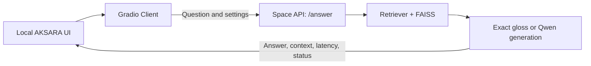

<p align="center"></p>

# AKSARA — AI Bahasa & Warisan Melayu

**Meneroka Warisan Melalui Bahasa.** A branded Gradio application for exploring Malay proverbs and their meanings, backed by the existing [Warisan2026/QA_Proverbs Space](https://huggingface.co/spaces/Warisan2026/QA_Proverbs).

The new interface combines midnight navy, teal and gold, heritage-inspired geometric accents, dark panels and a responsive main-content/sidebar layout. Interactive controls remain native Gradio components. Local previews use the original Space's API; running this repository does not modify or redeploy that Space.

## New AKSARA UI

| Area | Features |
| --- | --- |
| Branding | AKSARA logo, compact navigation, hero, about sidebar, feature cards and footer. |
| Questions | Four clickable examples, a question field, submit button and Enter submission. |
| Advanced settings | Proverb dropdown, Top-k 1–5, exact-gloss extraction and optional LoRA. |
| Jawapan | Readable answer card with copy control. |
| Konteks Diperoleh | Source cards retaining original scores, order and text, plus expandable raw context. |
| Log Teknikal | Submitted question, backend latency, model and original status. |
| Feedback | Processing status, Malay error messages and visible keyboard focus states. |

Typography uses Inter, Cinzel and Cormorant Garamond through Google Fonts with system-font fallbacks. The supplied component boards are visual references; they are not used as images of interactive controls.

## Architecture



The API receives `question`, `top_k`, `use_extraction` and `use_lora`. Its five original outputs remain unchanged; presentation helpers add escaped source cards and a runtime status display.

## Clone without downloading model weights

Requirements: Python 3.11, Git, Git LFS and internet access. The repository preserves the original backend artifacts through Git LFS. API mode only needs the small corpus file for the proverb dropdown.

```powershell
$env:GIT_LFS_SKIP_SMUDGE = "1"
git clone https://github.com/ariifahhh/aksara.git
Remove-Item Env:GIT_LFS_SKIP_SMUDGE
cd aksara
git lfs pull --include="artifacts/passages.jsonl"
```

On macOS/Linux, use `GIT_LFS_SKIP_SMUDGE=1 git clone https://github.com/ariifahhh/aksara.git`, then enter the directory and run the same `git lfs pull` command.

## Run locally

Use Python 3.11 and run from this repository so the existing artifact paths resolve:

```powershell
python -m venv .venv
.venv\Scripts\python -m pip install -r requirements-ui.txt
.venv\Scripts\python app.py
```

Open **http://127.0.0.1:7860** (or the URL printed by Gradio if that port is occupied). On macOS/Linux, create the environment with `python3.11 -m venv .venv` and use `.venv/bin/python` instead of `.venv\Scripts\python`.

Local runs now use the existing `Warisan2026/QA_Proverbs` Space's `/answer` API. Questions, Top-k and the extraction/LoRA settings are sent to that Space. No local Qwen, Torch, FAISS or retriever loading is needed. Internet access and an available Space are required; a sleeping or busy Space can take longer. The API returns the original five outputs unchanged. Its latency is backend time, excluding local network and queue overhead.

This does not upload, deploy, or change the original Space. Public access works without an API key; an existing `HF_TOKEN` environment variable is supported if authentication is needed.

The original local inference functions remain available using `AKSARA_BACKEND=local` after installing `requirements.txt`. In PowerShell:

```powershell
git lfs pull
.venv\Scripts\python -m pip install -r requirements.txt
$env:AKSARA_BACKEND = "local"
.venv\Scripts\python app.py
# Return to the default API mode:
Remove-Item Env:AKSARA_BACKEND
```

Inside a hosted Hugging Face Space (`SPACE_ID` is set), the default remains local inference to prevent a Space calling itself. No hosting change is part of this local setup.

Local inference requires the full artifacts, sufficient RAM and an initial download of `Qwen/Qwen2.5-1.5B-Instruct` (approximately 3.1 GB). The original code loads Qwen before checking the exact-gloss path and performs generation on CPU. API mode never automatically falls back to downloading a local model.

| Environment variable | Purpose |
| --- | --- |
| `AKSARA_BACKEND=space` | Use the existing Space API; the default on a local computer. |
| `AKSARA_BACKEND=local` | Run the original inference pipeline locally. |
| `HF_TOKEN` | Optional authentication token for the Gradio Client. Never commit it. |
| `SPACE_ID` | Set by Hugging Face hosting; changes the default to local inference. |

Questions and settings are transmitted to the original Space in API mode. Keep **Pengekstrakan glos tepat** enabled to use corpus definitions when available; disabling it runs Qwen generation and can be slower. Verify generated answers against the retrieved sources.

## Interface

- Example buttons populate the question; the submit button or Enter runs the existing backend.
- Advanced settings retain the proverb selector, Top-k (1–5), exact-gloss extraction and optional LoRA.
- Answer, retrieved source cards (with original scores/text), raw context, question echo, latency and backend status remain available in the three result tabs.
- API mode reports the actual adapter state as unverified, since the remote log only exposes the requested LoRA setting. Local inference mode checks the loaded adapter.
- All inference events share a single concurrency slot because the existing model instances are global.

## Files

- `app.py`: original model/retrieval/prompt/generation functions, backend selection and application entry point. Heavy AI imports only run in local inference mode.
- `remote_backend.py`: cached Gradio client forwarding the four original inputs and five outputs.
- `requirements-ui.txt`: lightweight dependencies for local API mode.
- `aksara_ui.py`: Gradio layout, escaped context formatting, status display and UI callbacks.
- `assets/aksara.css`: responsive AKSARA styling and typography.
- `assets/aksara-icon.png`: logo artwork extracted from the supplied component pack.

Model parameters, corpus, artifacts and the original AI dependency file are unchanged. No JavaScript or separate frontend service is required.

## Presentation checks

```powershell
.venv\Scripts\python -m unittest discover -s tests -v
```

These tests exercise UI output mapping, examples, input validation, error states,
escaped retrieval cards and shared inference concurrency without downloading models.

The suite contains ten tests, including remote argument forwarding, output-contract validation and startup without importing the local inference stack. These tests use mocks and do not send real questions to the Space.

The latest live check on 6 October 2026 completed seven requests through localhost. Warm extraction took 3.057–4.988 seconds end-to-end; one generation request took 32.712 seconds. Three of the four distinct example questions returned definitions belonging to different proverbs under the tested settings. Increasing Top-k to 5 recovered the correct corpus entry for “bagai aur dengan tebing”. See [the performance and progress report](PERFORMANCE.md) for measurements, reliability issues and next steps. These observations are not performance guarantees or an overall accuracy benchmark. Desktop/mobile visual inspection remains unverified because no browser connection was available.

## Troubleshooting

| Symptom | Check |
| --- | --- |
| API cannot answer | Check internet connectivity and whether the original Space is available. |
| Slow answer | Enable exact-gloss extraction. The Space may be sleeping, busy or generating with Qwen. |
| Local model starts downloading | Set `AKSARA_BACKEND=space` and restart the application. |
| Corpus loading fails | Run `git lfs pull --include="artifacts/passages.jsonl"` from the repository directory. |
| Old UI still appears | Stop the old application process, restart `app.py` and refresh the browser. |

## Original project and assets

The original backend and artifacts come from [Warisan2026/QA_Proverbs](https://huggingface.co/spaces/Warisan2026/QA_Proverbs/tree/main). The repository retains that history and adds the AKSARA UI and API connection mode. See [assets/README.md](assets/README.md) for the supplied logo artwork and font notes.
